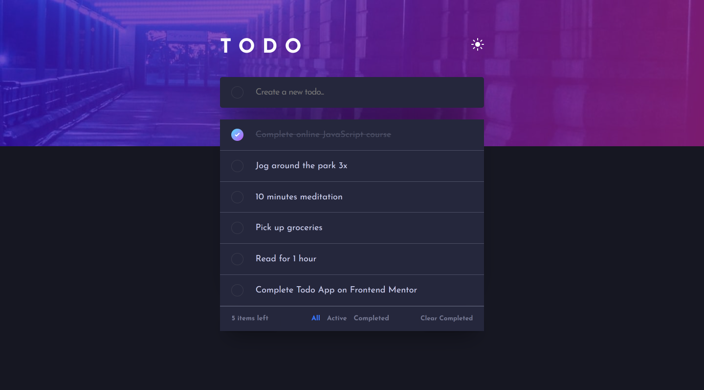
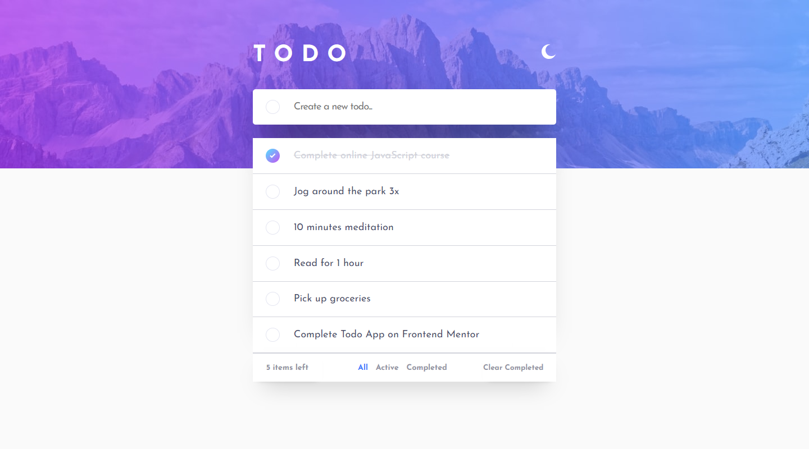
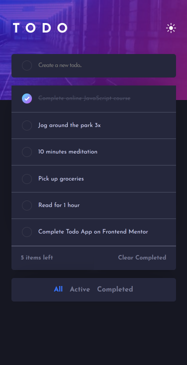
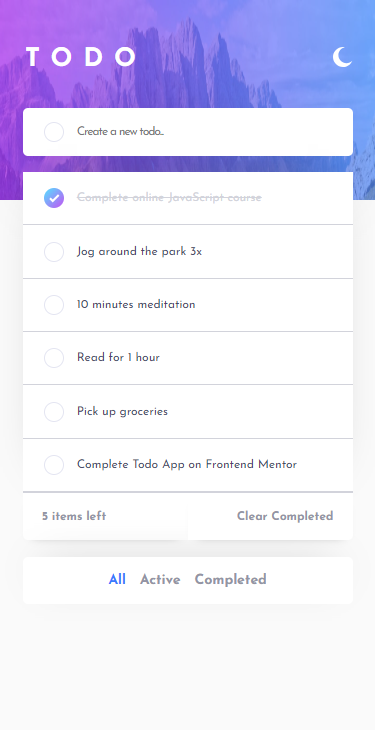

<h1 align="center">Frontend Mentor - Todo App</h1>

## Screenshot

  
  

## The challenge
Users should be able to:
- View the optimal layout for the app depending on their device's screen size
- See hover states for all interactive elements on the page
- Add new todos to the list
- Mark todos as complete
- Delete todos from the list
- Filter by all/active/complete todos
- Clear all completed todos
- Toggle light and dark mode
- **Bonus**: Drag and drop to reorder items on the list

## Links
- Solution URL: [https://www.frontendmentor.io/solutions/todo-app-pa-kBSFsOQ](https://www.frontendmentor.io/solutions/todo-app-pa-kBSFsOQ)
- Live Site URL: [https://todo-jec.vercel.app/](https://todo-jec.vercel.app/)

## Built with
- JavaScript
- TypeScript
- React
- Lib
  - [Formik](https://formik.org/)
  - [Yup](https://www.npmjs.com/package/yup)
  - [Drag and Drop](https://www.npmjs.com/package/react-beautiful-dnd)
- [Vite](https://vitejs.dev/)
- [ESlint](https://eslint.org/)
- HTML
- CSS